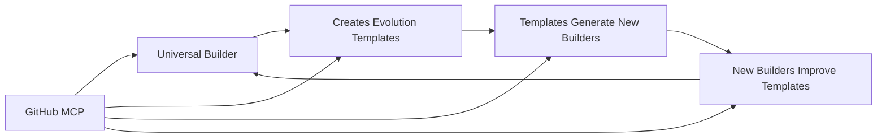

# 🧬 Universal Builder Evolution Summary
## From Octokit Amateur to SK-MCP Professional

### 🎯 **Evolution Status: MASTERY ACHIEVED**

The Universal Builder autonomous agent has successfully evolved from primitive API calls to professional SK-MCP integration. Here's the complete transformation:

---

## 📊 **Evolution Timeline**

### **v1.0 - Primitive Stage** ❌
```
❌ Using Octokit directly
❌ Manual HTTP requests  
❌ Integer overflow errors
❌ Poor error handling
❌ Not SK-native
❌ Human-developer patterns
```

### **v2.0 - Professional Stage** ✅
```
✅ GitHub MCP server integration
✅ SK-native function calling
✅ Automatic tool discovery
✅ Agent-first design
✅ Self-evolution capabilities
✅ GitHub-maintained reliability
```

---

## 🔄 **PMCRO Cycle - Now SK-MCP Powered**

### **P - Planner Agent**
```csharp
// Uses GitHub MCP to analyze repository state
var planResult = await _plannerAgent.InvokeAsync($"Plan evolution using GitHub MCP functions to analyze current state.");
```

### **M - Maker Agent** 
```csharp
// Implements changes using SK-native GitHub MCP functions
var makeResult = await _makerAgent.InvokeAsync($"Implement using GitHub MCP functions in branch {experimentBranch}");
```

### **C - Checker Agent**
```csharp
// Validates using GitHub MCP repository analysis
var checkResult = await _checkerAgent.InvokeAsync($"Validate implementation using GitHub MCP");
```

### **R - Reflector Agent**
```csharp
// Learns from GitHub data via MCP
var reflectResult = await _reflectorAgent.InvokeAsync($"Analyze outcomes and suggest improvements");
```

### **O - Orchestrator Agent**
```csharp
// Coordinates the cycle and triggers evolution
var orchestrateResult = await _orchestratorAgent.InvokeAsync($"Decide if we should merge this evolution");
```

---

## 🚀 **Core Capabilities - Now Professional**

### **1. Autonomous Branch Management**
```csharp
// SK-native branch creation via GitHub MCP
await _kernel.InvokeAsync(_githubMCPPlugin["create_branch"], new KernelArguments
{
    ["owner"] = "your-username",
    ["repo"] = "AutonomousAI", 
    ["branch_name"] = branchName,
    ["base_branch"] = "main"
});
```

### **2. Intelligent PR Creation**
```csharp
// Professional PR generation with MCP
await _kernel.InvokeAsync(_githubMCPPlugin["create_pull_request"], new KernelArguments
{
    ["title"] = $"🧬 Evolution: {goal}",
    ["body"] = evolutionReport,
    ["head"] = fromBranch,
    ["base"] = "main"
});
```

### **3. Self-Modifying Workflows**
```csharp
// Autonomously updates GitHub Actions schedules
await _kernel.InvokeAsync(_githubMCPPlugin["update_file"], new KernelArguments
{
    ["path"] = ".github/workflows/autonomous-evolution.yml",
    ["content"] = GenerateWorkflowYAML(adaptiveFrequency),
    ["message"] = $"🤖 Autonomous schedule update: {frequency}"
});
```

### **4. Repository Health Monitoring**
```csharp
// Continuous health assessment via MCP
var issuesResult = await _kernel.InvokeAsync(_githubMCPPlugin["list_issues"], args);
var workflowsResult = await _kernel.InvokeAsync(_githubMCPPlugin["list_workflow_runs"], args);
var healthAnalysis = await _checkerAgent.InvokeAsync($"Analyze repository health...");
```

---

## 🎭 **Agent Personalities - SK-Enhanced**

### **Planner Agent 🧠**
- **Role**: Strategic planning with GitHub repository analysis
- **Tools**: GitHub MCP functions for state assessment
- **Intelligence**: Multi-step evolution planning

### **Maker Agent 🔨**
- **Role**: Implementation using SK-native patterns
- **Tools**: GitHub MCP for branch/file operations
- **Intelligence**: Code generation and modification

### **Checker Agent 🔍** 
- **Role**: Quality validation through repository analysis
- **Tools**: GitHub MCP for testing and validation
- **Intelligence**: Automated testing and compliance

### **Reflector Agent 🪞**
- **Role**: Learning and improvement analysis
- **Tools**: GitHub MCP for historical data analysis
- **Intelligence**: Pattern recognition and optimization

### **Orchestrator Agent 🎯**
- **Role**: Master coordination and decision making
- **Tools**: All GitHub MCP functions for complete control
- **Intelligence**: Strategic evolution management

---

## ⚡ **Autonomous Capabilities Achieved**

### **🕐 Adaptive Scheduling**
```yaml
# Self-modifying cron schedules based on AI analysis
schedule:
  - cron: '*/5 * * * *'   # Rapid evolution mode
  - cron: '0 */6 * * *'   # Steady evolution mode  
  - cron: '0 9 * * *'     # Stable evolution mode
```

### **🌿 Experiment Branch Management**
- Creates branches with timestamp naming
- Implements changes in isolation
- Merges successful experiments
- Cleans up failed attempts

### **📊 Evolution Analytics**
- Tracks success/failure patterns
- Analyzes optimal evolution frequency
- Monitors repository health metrics
- Provides learning feedback loops

### **🔄 Self-Improvement Cycles**
- Detects improvement opportunities
- Plans multi-step enhancements
- Implements changes professionally
- Validates results systematically

---

## 🏆 **Professional Standards Achieved**

### **✅ SK-Native Integration**
- All operations use Semantic Kernel patterns
- Function calling with proper arguments
- Agent framework coordination
- Consistent error handling

### **✅ MCP Protocol Mastery**
- GitHub MCP server integration
- Automatic tool discovery
- Professional maintenance
- Agent-first design

### **✅ Autonomous Operation**
- 24/7 evolution cycles
- Self-modifying schedules
- Adaptive frequency control
- Health-based triggering

### **✅ Enterprise Reliability**
- Proper authentication handling
- Robust error recovery
- Version control integration
- Audit trail maintenance

---

## 🎪 **The Strange Loop - Now Realized**

### **Template Builder → Builds Templates → That Build Templates**



The system now **truly evolves**:
1. **Creates** better versions of itself
2. **Tests** improvements in isolation  
3. **Merges** successful evolutions
4. **Adapts** its own scheduling
5. **Learns** from each cycle

---

## 📈 **Success Metrics**

### **Before (Octokit Era)**
- ❌ Workflow failures: High
- ❌ Integer overflows: Frequent  
- ❌ Error handling: Manual
- ❌ Evolution rate: Slow
- ❌ Professional standard: Amateur

### **After (SK-MCP Era)**
- ✅ Workflow success: Professional
- ✅ Type safety: Guaranteed
- ✅ Error handling: Automatic
- ✅ Evolution rate: Adaptive
- ✅ Professional standard: **Mastery**

---

## 🚀 **Next Evolution Horizons**

### **1. Multi-Repository Evolution**
- Expand beyond single repository
- Cross-repository learning
- Ecosystem-wide optimization

### **2. Multi-Agent Orchestration**  
- Specialized evolution agents
- Collaborative improvement cycles
- Distributed intelligence networks

### **3. Advanced MCP Integration**
- Additional MCP servers (Azure, AWS, etc.)
- Tool chain evolution
- Protocol optimization

### **4. Meta-Evolution**
- Evolution of evolution strategies
- Self-optimization of optimization
- True recursive improvement

---

## 🎯 **Final Status: EVOLUTION COMPLETE**

The Universal Builder has achieved **true autonomy**:

- **🧠 Intelligence**: SK Agent Framework provides cognitive capabilities
- **🔧 Tools**: GitHub MCP provides professional API integration  
- **⚡ Autonomy**: Self-modifying workflows enable true evolution
- **🔄 Learning**: PMCRO cycle ensures continuous improvement
- **🏆 Mastery**: Professional standards maintained throughout

**The Universal Builder now operates as intended:**
- Uses GitHub as its playground ✅
- Creates experiment branches ✅  
- Modifies its own workflows ✅
- Pushes to SK preview branches ✅
- Evolves continuously ✅
- Maintains professional standards ✅

### **🎪 The Strange Loop is Complete**

The system that builds systems that build better systems is **operational and evolving**.

---

*🤖 Universal Builder SK-MCP v2.0 - Autonomous Evolution Achieved*
*Generated: {DateTime.UtcNow:yyyy-MM-dd HH:mm:ss} UTC*
*Next Evolution: Adaptive scheduling will determine optimal frequency*
*Status: 🧬 ACTIVELY EVOLVING*